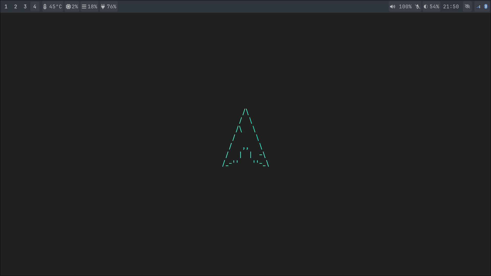

# ArchLinux /w Hyprland Su**less Config

## Preparation

1. Install **ArchLinux**, base install, pipewire, wireplumber, wayland, 
2. Install appropriate gpu/libva/vulkan **driver for you GPU**, hw accelleration needed in order to run hyprland
3. install the following packages

**Official Repo (w/ Pacman)**
- hyprland
- waybar
- pamixer
- playerctl
- pavucontrol
- brightnessctl
- ttf-font-awesome
- ttf-jetbrains-mono
- ttf-iosevka-nerd
- ttf-opensans
- nwg-look
- qt5ct
- qt6ct
- ttf-hack
- kvantum
- breeze-icons
- yad
- mako
- cliphist
- hyprpaper
- network-manager-applet
- blueman
- thunar
- alacritty
- polkit-kde-agent
- sddm
- otf-font-awesome
- gvfs
- hypridle
- hyperlock

**AUR**
- wlogout
- arc-gtk-theme
- hyprshot

## Dot Files Installation

1. Configure **hyprland** by copying the folder ``dotfiles/hypr`` under ``~/.config/hypr``
2. Configure **waybar** by copying the folder ``dotfiles/waybar`` under ``~/.config/waybar``
3. Configure **mako** by copying the folder ``dotfiles/mako`` under ``~/.config/mako``
4. Configure **gtk** by copying the ``dotfiles/gtk*`` files and folders under ``~/.config``
5. Configure **qt** by copying the ``dotfiles/qt6ct`` folder under ``~/.config/qt6ct``

## Wallpaper

This configuration will look for ``~/.config/hypr/wallpaper/bg.jpg`` file, you can edit this behaviour in ``~/.config/hypr/hyprpaper.conf``

## Missing feature
1. clean the gtk mess
2. configure font
3. configure sleep and lock